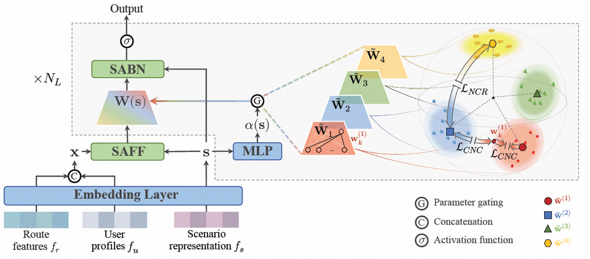
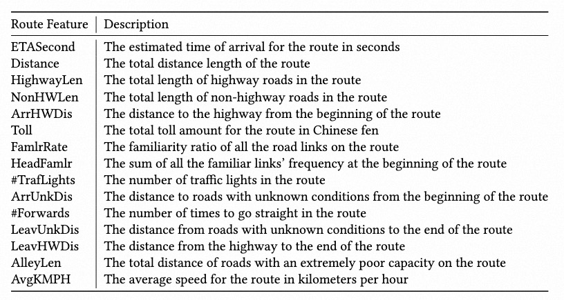
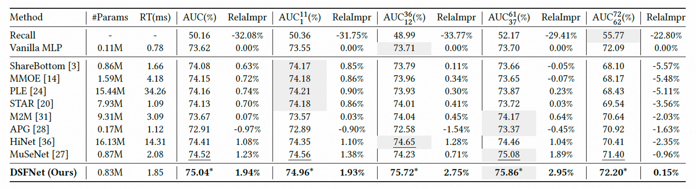
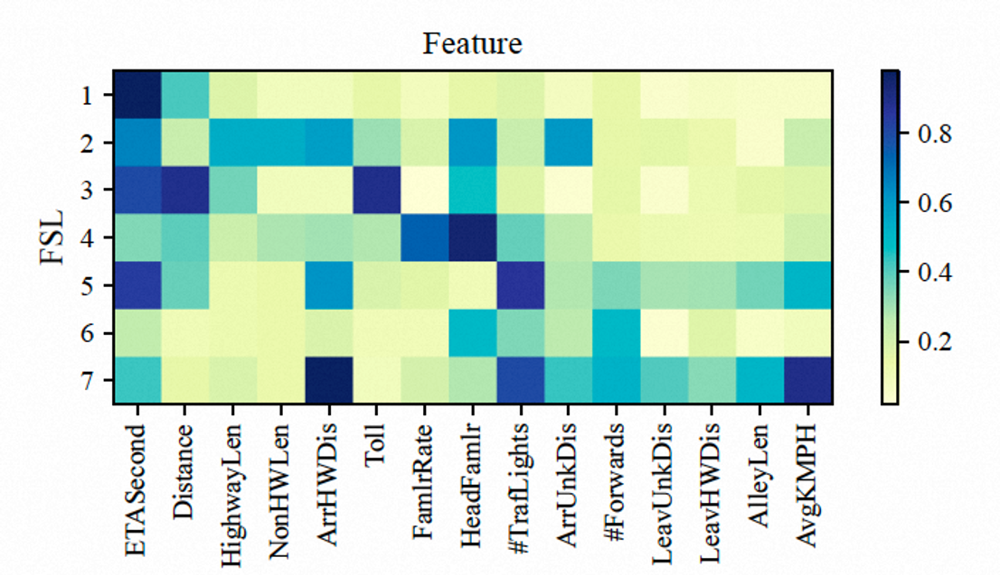

# DSFNet: Learning Disentangled Scenario Factorization for Multi-Scenario Route Ranking


<p align="center">
  <!-- 作者行 -->
  Jiahao Yu<sup>1</sup>,
  Yihai Duan<sup>1</sup>,
  Longfei Xu<sup>1†</sup>,
  Chao Chen<sup></sup>
  <br>
  Shuliang Liu<sup></sup>,
  Kaikui Liu<sup></sup>,
  Fan Yang<sup></sup>,
  Xiangxiang Chu<sup></sup>,
  Ning Guo<sup></sup>
  <br><br>
  <!-- 机构行 -->
   AMAP, Alibaba Group &nbsp;&nbsp;&nbsp;
  <br>
  <sup>1</sup>Equal Contribution &nbsp;&nbsp;&nbsp;
  <sup>†</sup>Corresponding author and Project lead.
</p>

<p align="center">
  <a href="https://dl.acm.org/doi/pdf/10.1145/3701716.3715219/" style="text-decoration: none;">
    
  </a>
  &nbsp;&nbsp;&nbsp;
  <a href="https://drive.google.com/drive/folders/1qk7p1PSvUucnEVVI0L2zchqmSD7hJSyI" style="text-decoration: none;">
    
  </a>
  &nbsp;&nbsp;&nbsp;
</p>


## 📖 Overview

<p align="center">
  
</p>

We propose a novel method, **D**isentangled **S**cenario **F**actorization **Net**work (**DSFNet**), which flexibly composes scenario-dependent parameters based on a high-capacity multi-factor-scenario-branch structure. Then, a novel regularization is proposed to induce the disentanglement of factor scenarios. Furthermore, two extra novel techniques, scenario-aware batch normalization and scenario-aware feature filtering, are developed to improve the network awareness of scenario representation. Additionally, to facilitate MSRR research in the academic community, we propose **MSDR**, the first large-scale publicly available annotated industrial **M**ulti-**S**cenario **D**riving **R**oute dataset. Comprehensive experimental results demonstrate the superiority of our DSFNet, which has been successfully deployed in AMap to serve the major online traffic.

## 📊 Dataset
Since there are no available benchmarks for evaluating MSRR models in the academic community, we propose **M**ulti-**S**cenario **D**riving **R**oute dataset (MSDR), the first large-scale publicly available annotated industrial dataset, to facilitate MSRR research in the academia. Here is a simple dataset in `ucore/data` and a more comprehensive dataset in [Google Drive](https://drive.google.com/drive/folders/1qk7p1PSvUucnEVVI0L2zchqmSD7hJSyI).


<div style="display: flex; align-items: center;">
  
    <div>
    <h3>Key Features</h3>
    <p>We sampled data from eight big cities in China: Beijing, Shanghai, Guangzhou, Hangzhou, Wuhan, Zhengzhou, Chongqing, and Chengdu. Each data sample includes abundant route features, fine-grained scenario representation, user profiles, and a preference label. Specifically, the left table exhibits some route features provided in MSDR.</p>
  </div>

</div>


## 🎉 Results

<p align="center">
  
</p>
As shown, our DSFNet achieves the best performance on the overall MSDR and the four subsets.


<div style="display: flex; align-items: center;">
  
    <div>
    <h3>Interpretability</h3>
    <p>We conduct an interpretability study to unveil the disentangled factor scenario each FSL learns. We select some significant route features and exhibit the corresponding attention values from all FSLs in the left figure, which essentially reveals the diverse user preferences under different factor scenarios.</p>
  </div>

</div>


## 📚 Citation

If you find our paper and code helpful for your research, please consider starring our repository ⭐ and citing our work ✏️.
```bibtex
@inproceedings{yu2025dsfnet,
  title={DSFNet: Learning Disentangled Scenario Factorization for Multi-Scenario Route Ranking},
  author={Yu, Jiahao and Duan, Yihai and Xu, Longfei and Chen, Chao and Liu, Shuliang and Liu, Kaikui and Yang, Fan and Chu, Xiangxiang and Guo, Ning},
  booktitle={Companion Proceedings of the ACM on Web Conference 2025},
  pages={567--576},
  year={2025}
}
```

